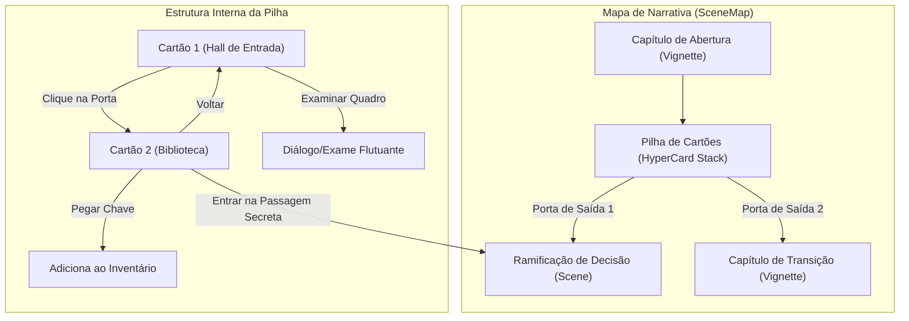
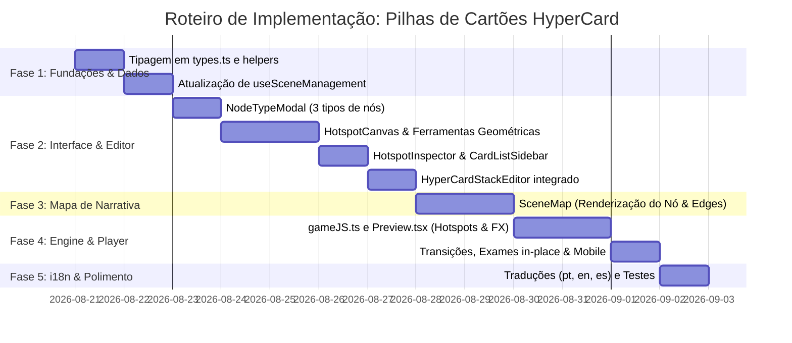

# Arquitetura e Plano: Pilha de Cartões (HyperCard Stacks / Hotspots Interativos)

> **Inspiração:** HyperCard (Apple, 1987) e Point-and-Click Adventure / Visual Interactive Fiction.  
> **Objetivo:** Permitir a criação de cenas interativas baseadas em imagens com áreas clicáveis (hotspots/hiperlinks) que realizam ações ricas (navegação entre cartões ou nós do mapa, exames in-place, manipulação de inventário, gatilhos de contadores e efeitos sonoros).

---

## 1. Visão Geral da Arquitetura

O recurso é estruturado como um novo tipo de nó de primeira classe no IF Builder: a **Pilha de Cartões (`hypercard_stack`)**. Uma pilha funciona como um contêiner/sub-grafo navegável de múltiplos **Cartões (`HyperCard`)**, cada um contendo uma imagem de fundo e uma coleção de **Áreas Interativas (`CardHotspot`)**.



---

## 2. Modelo de Dados e Tipos TypeScript (`src/types.ts`)

```typescript
export type HotspotShape = 'rect' | 'circle' | 'polygon';

export type HotspotHighlightStyle = 
  | 'hidden'           // Totalmente invisível (Pixel Hunt clássico)
  | 'hover-glow'       // Brilho / contorno suave ao passar o mouse
  | 'subtle-border'    // Borda sutil permanente
  | 'always-visible'   // Realce visível permanente
  | 'pulsing-pin';     // Marcador/Pin pulsante com ícone

export type HotspotCursor = 
  | 'pointer' 
  | 'magnify' 
  | 'hand' 
  | 'eye' 
  | 'arrow-up' 
  | 'arrow-down' 
  | 'arrow-left' 
  | 'arrow-right' 
  | 'door';

export type HotspotActionType = 
  | 'navigate_card'     // Muda para outro cartão dentro da mesma pilha
  | 'navigate_scene'    // Sai da pilha para uma Ramificação ou Capítulo
  | 'examine'           // Exibe balão/diálogo de exame sem sair do cartão
  | 'collect_item'      // Coleta um item para o inventário
  | 'toggle_tracker';   // Altera valores de ConsequenceTrackers

export interface HotspotPolygonPoint {
  x: number; // Porcentagem responsiva (0 a 100)
  y: number; // Porcentagem responsiva (0 a 100)
}

export interface CardHotspot {
  id: string;
  title: string; // Tooltip / Rótulo de acessibilidade
  shape: HotspotShape;
  
  // Bounding box em porcentagem (0-100%) para responsividade absoluta
  x: number;
  y: number;
  width: number;
  height: number;
  points?: HotspotPolygonPoint[]; // Usado quando shape === 'polygon'

  // Aparência e Feedback
  highlightStyle: HotspotHighlightStyle;
  cursor?: HotspotCursor;
  icon?: string; // Nome de ícone Lucide para pins
  soundEffect?: string; // Base64 data URL
  soundEffectName?: string;

  // Ações e Destinos
  actionType: HotspotActionType;
  targetCardId?: string;   // Destino interno
  targetSceneId?: string;  // Destino externo (outro nó no mapa)

  // Ação de Exame (In-place modal/balão)
  examineTitle?: string;
  examineText?: string;
  examineImage?: string; // Opcional: imagem de close-up

  // Inventário e Contadores
  requiresInInventory?: string;
  consumesItem?: boolean;
  addsToInventory?: string;
  trackerEffects?: TrackerEffect[];

  // Bloqueio / Condições
  lockedMessage?: string;
}

export interface HyperCard {
  id: string;
  name: string;
  image: string; // URL ou base64
  description?: string; // Texto descritivo/subtítulo opcional do cartão
  hotspots: CardHotspot[];
  backgroundMusic?: string;
  backgroundMusicName?: string;
  transition?: 'cut' | 'dissolve' | 'wipe-left' | 'wipe-right' | 'iris' | 'zoom';
  transitionSpeed?: number; // milissegundos
}

// Extensão na interface Scene para manter 100% de compatibilidade reversa
export interface Scene {
  // ... campos existentes ...
  sceneType?: 'branch' | 'vignette' | 'hypercard_stack';
  stackCards?: HyperCard[];
  startCardId?: string;
  enableRevealZonesButton?: boolean;
}
```

---

## 3. Componentes e Estrutura de Arquivos

### 3.1. Novos Componentes do Editor (`src/components/HyperCardEditor/`)

1. **`HyperCardStackEditor.tsx`**:
   - Container principal em tela cheia ou modal expandido.
   - Header com título da pilha, seletor de cartão inicial e botões de pré-visualização rápida.
   - Layout de 3 painéis:
     - **Painel Esquerdo (`CardListSidebar.tsx`):** Fita/Carrossel vertical dos cartões da pilha com thumbnail, contagem de hotspots, botões para adicionar, duplicar, reordenar e excluir cartões.
     - **Painel Central (`HotspotCanvas.tsx`):** Superfície de desenho interativa sobre a imagem do cartão com zoom, pan, ferramentas de desenho (Retângulo `R`, Círculo `C`, Polígono `P`), alças de redimensionamento e modo de teste instantâneo.
     - **Painel Direito (`HotspotInspector.tsx`):** Inspetor de propriedades do hotspot selecionado (título, estilo visual, cursor, ação, conexões internas/externas, inventário e som).

2. **`HotspotCanvas.tsx`**:
   - Renderização da imagem com cálculo proporcional baseado em `getBoundingClientRect` para tradução precisa de coordenadas tela ↔ porcentagem (0-100%).
   - Layer SVG com renderização dos elementos interativos: `<rect>`, `<circle>`, `<polygon>`.
   - 8 alças de redimensionamento nos vértices e arestas dos retângulos/círculos e edição de nós dos polígonos.
   - Teclas de atalho: `Delete` para excluir, `Ctrl+D` para duplicar, `Espaço + Arrastar` para pan do canvas.

3. **`HotspotInspector.tsx`**:
   - Abas organizadas: *Geral & Visual*, *Ação & Destino*, *Condições & Efeitos*.
   - Seletor inteligente de nós do projeto (com busca de cenas, ramificações e capítulos).

### 3.2. Integração com o Modal de Criação de Nós (`NodeTypeModal.tsx`)

- Atualização de grid de 2 para 3 opções elegantes:
  1. **Capítulo** (Abertura / Transição) - Púrpura / Violeta
  2. **Ramificação** (Decisão / Parser / Múltipla Escolha) - Azul / Ciano
  3. **Pilha de Cartões** (Cena Interativa com Imagem / HyperCard) - Esmeralda / Verde-Teal
     - Descrição: *"Explore cenários visuais, aponte e clique em áreas interativas e navegue por cartões virtuais inspirados no HyperCard."*
     - Tags: `POINT & CLICK`, `HOTSPOTS`, `HIPERLINK`, `EXPLORAÇÃO`

### 3.3. Integração com o Mapa de Narrativa (`SceneMap.tsx`)

- Nó customizado para Pilhas de Cartões com cor temática (Esmeralda/Teal).
- Exibição de miniatura do cartão inicial + contador estilizado `📑 X Cartões`.
- **Conectores de Saída Dinâmicos:** A lista de saídas externas configuradas nos hotspots de todos os cartões da pilha é renderizada no lado direito do nó, gerando as curvas de conexão (Edges) até as cenas de destino no mapa.
- Duplo-clique no nó abre diretamente o editor de cartões.

### 3.4. Engine do Jogo e Player (`src/components/gameJS.ts` & `src/components/Preview.tsx`)

- Suporte completo à renderização de `hypercard_stack`:
  - Imagem do cartão em tela cheia/moldura responsiva.
  - Overlay de hotspots posicionados em porcentagem com suporte total a telas touch (mobile) e mouse (desktop).
  - Hover states: mudança de cursor dinâmico (`magnify`, `hand`, `door`, etc.), brilho suave e tooltips.
  - **Botão "Revelar Zonas" (Ícone de Olho / Tecla Espaço):** Faz todos os hotspots pulsarem suavemente na tela para acessibilidade e suporte touch.
  - **Balão / Modal de Exame Flutuante:** Renderiza caixas de diálogo tematizadas (com efeito de digitação e botão fechar) sem recarregar a tela.
  - Transições animadas entre cartões: *Dissolve*, *Wipe (Deslizar)*, *Iris*, *Zoom*, *Instantâneo*.
  - Suporte a verificação de requisitos de inventário e incremento/decremento de contadores de consequências.

---

## 4. Plano de Implementação em Fases



---

## 5. Plano de Verificação e Testes

- **Testes Unitários:**
  - Criação, duplicação e exclusão de cartões e hotspots dentro de uma pilha.
  - Conversão e normalização de coordenadas tela ↔ porcentagem.
  - Validação de integridade de referências ao deletar nós ou cartões.
- **Testes de Integração e UI:**
  - Fluxo completo no editor: Criar nó de pilha no mapa -> Desenhar retângulo, círculo e polígono -> Configurar link para outro cartão -> Configurar link de saída para uma Ramificação.
  - Teste de pré-visualização (`Preview.tsx`) e exportação HTML autônoma.
  - Teste de responsividade em mobile (viewport reduzido e toques touch).
