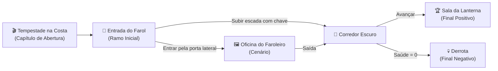

# Módulo 11 — Mapa de Ramificações

**Tutorial: A Chave do Farol**  
Tempo estimado: 6–8 minutos

---

## Objetivo deste módulo

Neste módulo você vai aprender a usar o **Mapa de Ramificações (Scene Map)** para enxergar e organizar toda a estrutura da sua ficção:
- Acessar e navegar pelo grafo visual interativo
- Identificar Capítulos, Ramificações e Cenários no mapa
- Rastrear caminhos, conexões e finais alternativos
- Encontrar nós órfãos ou conexões quebradas
- Usar atalhos de navegação e organização visual

---

## O que é o Mapa de Ramificações?

O **Mapa de Ramificações** é um diagrama interativo estilo grafo que conecta automaticamente todos os nós narrativos do seu projeto com base nas decisões, portas e interações configuradas:

---

## Passo 1 — Acessar o Mapa

1. No menu lateral, clique em 📖 **Narrativa**.
2. No topo da coluna de lista de cenas, clique no botão **"Mapa de Ramificações"** (ícone de rede / nós conectados).

---

## Passo 2 — Ferramentas de Navegação do Grafo

- **Mover o Mapa (Pan)**: Clique em uma área vazia e arraste para explorar diferentes seções da sua história.
- **Zoom In / Zoom Out**: Use a roda do mouse (*scroll*) ou os botões `+` e `-` no canto da tela.
- **Reposicionar Nós**: Clique e arraste qualquer cartão para organizar colunas temporais ou fluxos lógicos.
- **Abrir para Edição**: Dê um **duplo clique** sobre qualquer nó para saltar diretamente para o editor daquela cena.

---

## Passo 3 — Distinção Visual dos Nós

O mapa utiliza cores e molduras distintas para você identificar o papel de cada nó à primeira vista:

| Estilo do Cartão | Significado |
|------------------|-------------|
| 🟢 **Destaque Verde / Casa** | **Nó Inicial da História** (por onde a aventura começa). |
| 🎬 **Borda Dourada / Película** | **Capítulo (Vinheta)** cinematográfica. |
| 🖼️ **Moldura com Camadas** | **Cenário (Point-and-Click)** com múltiplas vistas internas. |
| 🏁 **Borda de Alerta / Troféu** | **Ramo de Encerramento** (Vitória ou Derrota). |
| ⚠️ **Nó Isolado** | Nó sem conexões de entrada — pode ser um beco sem saída ou cena esquecida. |

---

## Passo 4 — Validando a Integridade da História

Use o mapa para fazer um controle de qualidade do fluxo narrativo:
1. Verifique se o nó inicial alcança todos os ramos pretendidos.
2. Certifique-se de que não existem ramificações "sem volta" que não sejam finais oficiais de jogo.
3. Confira se as saídas dos seus **Cenários (Hotspots)** conectam corretamente às ramificações seguintes.

---

## ✅ Checklist do Módulo 11

- [ ] Mapa de ramificações aberto e explorado
- [ ] Nós de *A Chave do Farol* organizados visualmente da esquerda para a direita
- [ ] Conexões entre Abertura, Entrada, Corredor, Oficina e Finais verificadas

---

## Próximo passo

Aprenda a empacotar e publicar sua ficção para qualquer pessoa jogar no navegador ou no desktop:

→ [**Módulo 12 — Exportação e Publicação**](./12-exportacao-e-publicacao.md)
