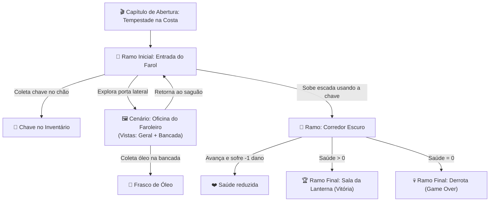

# Módulo 13 — Projeto Exemplo Completo ("A Chave do Farol")

Este módulo consolida todos os conceitos aprendidos ao longo do tutorial em um único roteiro prático e detalhado de ponta a ponta.

---

## 🗺️ Visão Geral da Ficção



---

## 📋 Resumo das Configurações do Projeto

### 1. Mecânicas e Sistemas (Menu Lateral → Mecânicas)
- **Modo de Interação**: Parser (Comandos digitados).
- **Inventário**: Ativado (capacidade de 5 kg, feedback de inventário vazio personalizado).
- **Rastreadores**: Ativado (exibição de Saúde na barra superior).
- **Diário de Bordo**: Ativado com auto-scroll.

### 2. Estilo Visual e Efeitos (Menu Lateral → Estilo Visual)
- **Tema Base**: Meia-Noite (fundo preto azulado, texto prateado).
- **Destaque `<palavra>`**: Verde esmeralda brilhante (`#2ecc71`).
- **Efeitos de Tela**: Chuva dinâmica ativada para simular a tempestade marítima.

### 3. Rótulos (Menu Lateral → Rótulos)
- **Botão de Início**: `Entrar no Farol`
- **Placeholder do Parser**: `O que você deseja fazer na escuridão?`
- **Feedback Desconhecido**: `O uivo do vento abafa sua tentativa. Tente outra ação.`

---

## 🏗️ Estrutura dos Nós Narrativos

### 1. Capítulo: Tempestade na Costa (Abertura)
- **Tipo**: Capítulo (Vinheta).
- **Texto**: *As ondas colidem furiosamente contra as rochas pontiagudas. O vento gelado corta a escuridão enquanto a silhueta solitária do farol surge no topo do penhasco. Você precisa encontrar abrigo antes que o mar engula o caminho.*
- **Botão**: `Entrar no Farol` → Destino: `Entrada do Farol`.

### 2. Ramificação: Entrada do Farol (Início)
- **Texto**:
```
A tempestade do lado de fora faz as antigas janelas vibrarem.

O interior do farol é úmido, frio e silencioso. Uma <escada de ferro> sobe em espiral em direção à escuridão do topo. À direita, uma porta aberta leva à <oficina do faroleiro>. Próximo à soleira, meio enterrada na poeira, repousa uma <chave enferrujada>.

O uivo do vento ecoa pelas frestas das paredes de pedra.
```
- **Objetos Vinculados**: `Chave Enferrujada`, `Escada de Ferro`.
- **Interações**:
  1. *Pegar Chave*: Verbos: `pegar, coletar, tomar chave` → Adiciona ao Inventário e remove da sala.
  2. *Subir sem Chave*: Verbos: `subir escada` → Mensagem: `O alçapão está trancado por um cadeado pesado. Você precisa de uma chave.`
  3. *Subir com Chave*: Verbos: `subir escada, usar chave` → Requer: `Chave Enferrujada` → Destino: `Corredor Escuro`.
  4. *Ir para a Oficina*: Verbos: `entrar oficina, ir oficina, oficina` → Destino: `Oficina do Faroleiro`.

### 3. Cenário: Oficina do Faroleiro (Point-and-Click)
- **Vista 1 (Visão Geral)**:
  - Hotspot sobre a bancada: Ação: **Mudar de Vista** → Destino: `Bancada de Ferramentas`.
  - Hotspot sobre a porta: Ação: **Navegar para Nó** → Destino: `Entrada do Farol`.
- **Vista 2 (Bancada de Ferramentas)**:
  - Hotspot sobre o frasco: Ação: **Coletar Objeto** → `Frasco de Óleo`.
  - Hotspot inferior: Ação: **Mudar de Vista** → Destino: `Visão Geral da Oficina`.

### 4. Ramificação: Corredor Escuro
- **Texto**:
```
Você alcança o patamar superior da escadaria. A escuridão aqui é densa e o chão está congelado.

No fim do corredor, você distingue o contorno da porta que leva à cúpula da lanterna.
```
- **Interação**:
  - *Continuar*: Verbos: `continuar, avancar, entrar porta` → Destino: `Sala da Lanterna`, Efeito: `Saúde -1`.

### 5. Ramificação: Sala da Lanterna (Vitória)
- **Texto**: *A cúpula de vidro no topo do farol se abre diante de você. O mecanismo da grande lanterna ainda funciona — feixes luminosos cortam a tempestade lá fora. O farol está ativo novamente!*
- **Propriedade**: Marcado como **Ramo de Encerramento**.

### 6. Ramificação: Derrota (Game Over)
- **Texto**: *O frio intenso e a exaustão foram mais fortes que sua determinação. Suas forças se esgotaram e a escuridão do farol tomou conta de tudo.*
- **Propriedade**: Marcado como **Ramo de Encerramento**.

---

## 🎮 Roteiro de Testes (Passo a Passo)

### Caminho da Vitória:
1. Inicie o jogo → Clique em **"Entrar no Farol"**.
2. Na Entrada:
   - Digite `olhar` ou clique em `<chave enferrujada>`.
   - Digite `pegar chave` (a chave entra no inventário).
   - Digite `subir escada` (o cadeado é aberto e você avança).
3. No Corredor Escuro:
   - Digite `continuar` (a Saúde cai para 2/3 e você alcança o topo).
4. Na Sala da Lanterna:
   - Veja a mensagem de vitória e o encerramento da narrativa!

### Caminho da Derrota (Teste do Rastreador):
1. No Corredor Escuro, digite comandos que reduzam a Saúde até 0.
2. Observe o redirecionamento automático para a tela de **Derrota**.

---

## 🏁 Parabéns!

Você completou o guia tutorial do **IF Builder**! Agora você domina:
- Escrita de narrativas ramificadas e capítulos cinematográficos
- Criação de cenários visuais point-and-click com vistas e hotspots
- Customização de mecânicas, estilos de interface, efeitos e rótulos
- Criação de itens, interações inteligentes, rastreadores e publicação web

**Boas criações e divirta-se construindo mundos extraordinários!**
